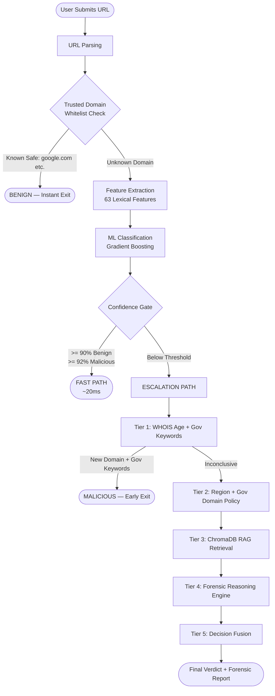
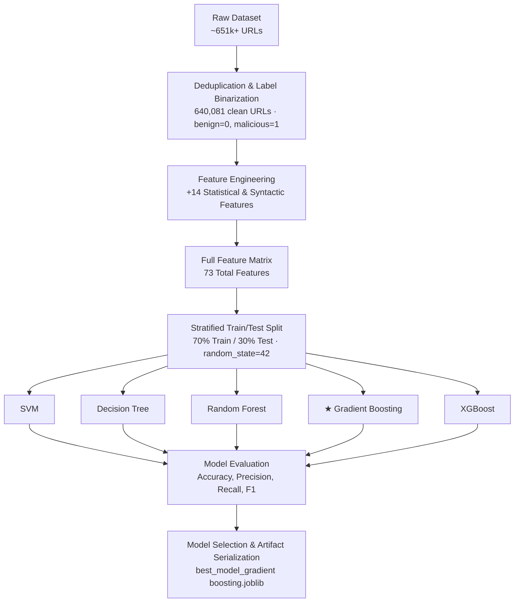
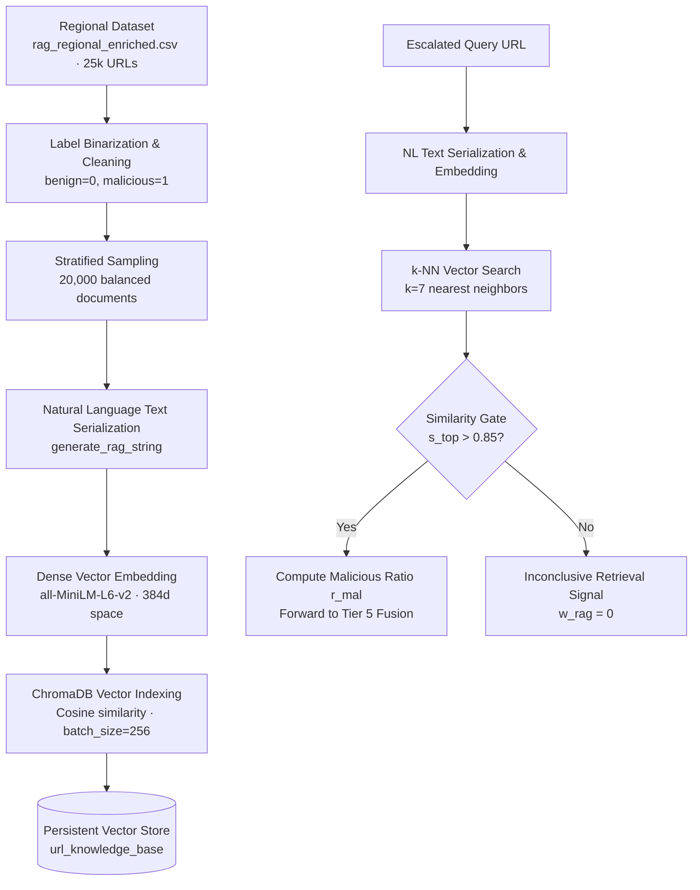
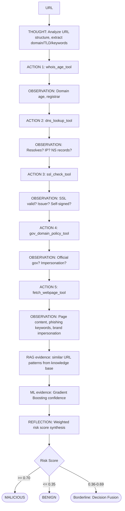
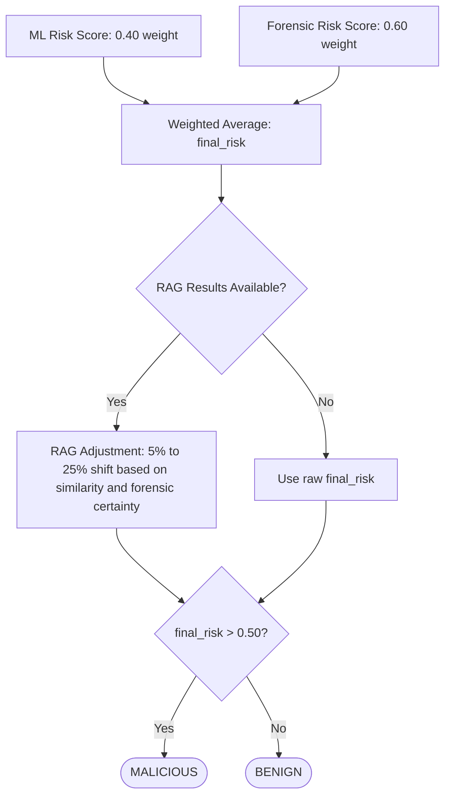

# ThreatLens: A Latency-Aware Hybrid Escalation Architecture for Malicious URL Detection with Regional Retrieval-Augmented Reasoning

------------------------------------------------------------------------

## Abstract

Machine-learning classifiers for malicious URL detection routinely report accuracies above 99% on curated global datasets, yet this performance is known to degrade sharply — to as low as 55–60% — when the same features and models are applied to underrepresented regional domains, a limitation documented in prior work on Mongolian government and educational infrastructure. Closing this gap by manually engineering region-specific features does not scale: every new country or naming convention requires renewed feature engineering and retraining. This paper presents **ThreatLens**, a five-tier, latency-aware hybrid escalation architecture that resolves the trilemma of throughput, regional adaptability, and explainability without resorting to per-region feature hardcoding. ThreatLens routes the majority of incoming URLs through a fast, fully offline lexical classifier (Gradient Boosting, 73 engineered features, ~20 ms inference), and escalates only the subset of URLs for which the classifier's confidence falls below a calibrated threshold  through progressively deeper verification tiers: live domain forensics (WHOIS, DNS, SSL/TLS), a Retrieval-Augmented Generation (RAG) knowledge base of 25,000 balanced, multi-regional URLs embedded via a sentence-transformer model, and a deterministic, rule-grounded Forensic Reasoning Engine that produces a human-readable, ReAct-style evidence trace without invoking a neural language model at inference time. Component outputs are combined through an empirically validated, confidence-gated fusion formula with a veto mechanism for high-certainty forensic evidence. On a 640,081-URL global holdout set, the primary Gradient Boosting classifier achieves 93.94% test accuracy (96.45% precision, 84.89% recall); an ablation study demonstrates that the RAG retrieval tier alone contributes a +2.90 percentage-point accuracy improvement and a +5.43 percentage-point precision improvement over the ML baseline. We further identify a methodological limitation common to this literature — row-level random train/test splitting, which permits same-domain URL leakage across partitions — and propose a domain-grouped evaluation protocol as a direction for more rigorous future benchmarking. We report failure modes transparently, including performance under regional class imbalance, and discuss the architecture's latency, memory, and scalability trade-offs.

------------------------------------------------------------------------

## 1. Introduction

### 1.1 Motivation and the Global Threat Landscape

Global digital connectivity continues to expand at an unprecedented pace, and this expansion has been accompanied by a proportional rise in the scale, velocity, and complexity of cyber-enabled threats. Phishing, credential harvesting, and social-engineering campaigns remain among the most common vectors through which attackers compromise individuals and organizations, and malicious hyperlinks serve as the foundational delivery mechanism for the large majority of these attacks. Because a URL is typically the first — and often the only — artifact a defender can inspect before a user reaches attacker-controlled infrastructure, accurate and low-latency URL classification remains one of the most actionable points of interception available to modern security systems.

### 1.2 Limitations of Existing Detection Paradigms

Countermeasures against malicious URLs in the existing literature span three broad paradigms, each exhibiting a distinct structural limitation.

**Static blacklisting systems**, such as those built on repositories like PhishTank and Google Safe Browsing, perform fast lookup matching against historically confirmed malicious domain databases. While computationally inexpensive, these systems are inherently retroactive: a URL that is not yet present in the database is, by construction, classified as safe, regardless of its actual risk. This makes blacklists structurally blind to zero-day phishing domains and short-lived, disposable infrastructure.

**Feature-based machine learning classifiers** — typically Random Forest, Support Vector Machine, or Gradient Boosting models trained on lexical, host-based, and content-based URL attributes — generalize beyond static lists and represent the dominant baseline in the academic literature. However, these classifiers are static once trained, and their decision boundaries reflect the distribution of their training data. This creates a specific and well-documented failure mode: regional and domain distribution shift. Bat-Erdene et al. demonstrated this directly — a 52-feature Gradient Boosting classifier trained on a large global corpus achieved 99.87% accuracy on foreign URLs, yet its accuracy on Mongolian `.gov.mn`/`.edu.mn` infrastructure, evaluated on the same feature set, fell to 55–60% before any regional adjustment. The authors partially recovered performance (to 75.15–75.46%) by hand-engineering sixteen Mongolia-specific static features (`is_gov_domain`, `is_ministerial_domain`, `has_mongolian_region`, and related indicators). This recovery came at the cost of scalability: extending the same accuracy to a new country requires repeating the feature-engineering and retraining cycle for that country's specific naming conventions, an approach that does not scale to a global deployment covering many jurisdictions.

**Agentic Large Language Model (LLM) and Retrieval-Augmented Generation (RAG) systems** represent a more recent paradigm that addresses several of the above limitations. RAG frameworks augment a classifier or reasoning engine with an external knowledge base — such as a vector-indexed repository of known threat patterns, regional domain registries, or curated URL datasets — by retrieving contextually similar entries at inference time and injecting them into the decision process. This retrieval mechanism allows a system to absorb new regional or temporal threat intelligence (for example, a newly emerging phishing campaign targeting a specific country's government portals) by adding documents to the knowledge base, without retraining the underlying model or re-engineering its feature set. Agentic LLM architectures extend this further by equipping a language model with tool-use capabilities — the ability to invoke live network forensic operations such as DNS resolution, WHOIS lookups, SSL/TLS certificate inspection, and live page content retrieval — and to reason over the combined retrieved and live evidence in a structured chain-of-thought or ReAct-style loop, producing human-readable threat explanations alongside a verdict. However, both mechanisms carry significant computational overhead when applied indiscriminately: a single RAG retrieval cycle involving embedding computation and vector similarity search adds tens to hundreds of milliseconds, and a full agentic LLM reasoning pass — involving multiple sequential tool invocations followed by neural inference — commonly exceeds 1500 ms per query. For an enterprise-grade URL screening system processing thousands of URLs per second, applying this depth of analysis to every incoming request is neither economically nor operationally viable. This motivates an architectural design in which RAG retrieval and agentic reasoning are reserved for the minority of URLs that a fast, lightweight classifier cannot resolve with sufficient confidence.

### 1.3 Key Contributions

To address the combined challenge of throughput, regional adaptability, and explainability, this paper introduces **ThreatLens**, a latency-aware, five-tier hybrid escalation framework. ThreatLens routes the large majority of incoming web traffic through a fast, fully offline lexical classifier, and dynamically escalates only ambiguous or out-of-distribution samples through progressively deeper verification tiers. The primary contributions of this paper are as follows:

- **A latency-aware escalation architecture.** We propose a five-tier pipeline (Tier 0 trusted-domain whitelist, Tier 1 ML classification with a calibrated confidence gate, and Tiers 2–4 progressively deeper live forensics, regional retrieval, and rule-grounded reasoning) that resolves the large majority of traffic in under 20 ms (under 5 ms for whitelisted domains) while reserving expensive live verification — WHOIS, DNS, SSL/TLS inspection, and live page content analysis — for the empirically estimated 13% of URLs on which the fast classifier is not sufficiently confident.

- **Region-agnostic adaptation via retrieval rather than feature hardcoding.** Instead of manually engineering static, country-specific binary indicators for each new jurisdiction — an approach we show does not scale — ThreatLens incorporates regional threat context through a Retrieval-Augmented Generation knowledge base built over natural-language structural descriptions of URLs. This allows the system to absorb new regional threat intelligence by adding documents to the knowledge base, without retraining the underlying classifier.

- **An empirically calibrated, multi-source decision fusion formula.** We formulate a confidence-gated fusion function that combines the ML classifier's probability output, a deterministic forensic reasoning engine's weighted risk score, and a similarity-gated RAG adjustment into a single, calibrated final risk score, and validate the resulting weighting through a sensitivity analysis over six candidate weight configurations.

- **Identification of, and a proposed remedy for, a shared evaluation limitation.** We identify a methodological limitation common to this literature — standard row-level random train/test splitting, which permits URLs from the same registrable domain to appear in both the training and test partitions, potentially inflating reported accuracy through domain memorization rather than genuine generalization. We retain the standard split in this work to preserve direct comparability with prior results, but we formalize a domain-grouped evaluation protocol, in which no registrable domain crosses the train/test boundary, as a concrete direction for more rigorous future evaluation of ThreatLens and comparable systems.

### 1.4 Paper Organization

The remainder of this paper is organized as follows. Section 2 reviews related work in feature-based URL classification, regional domain bias, and agentic RAG frameworks, and situates the present contribution relative to Bat-Erdene et al.'s baseline study. Section 3 describes the ThreatLens system architecture, including the five-tier escalation pipeline and the decision fusion formula. Section 4 details the experimental setup, datasets, and feature engineering methodology. Section 5 presents the machine learning model comparison, ablation study, weight-sensitivity analysis, and latency profile. Section 6 provides a comparative discussion against the baseline study. Section 7 discusses observed failure modes and system limitations, and Section 8 concludes the paper with directions for future work.

------------------------------------------------------------------------

## 2. Related Work

### 2.1 Taxonomy of Feature-Based Machine Learning Approaches

Machine learning approaches to malicious URL detection have evolved from simple string-heuristic checks to multi-modal feature extraction pipelines. Taxonomies established in the broader survey literature typically categorize URL features into five groups: **lexical features** (syntactic properties of the URL string itself, such as length, path depth, character entropy, and special-character ratios); **host-based features** (network-level characteristics such as DNS record presence, WHOIS domain age, and IP-hosting attributes); **content-based features** (properties obtained by retrieving the page itself, such as iframe usage, redirection chains, and embedded scripts); **anomaly-based features** (structural irregularities such as Punycode homograph encoding and mixed character sets); and **HTML/JavaScript-based features** (Document Object Model mutation behavior, inline script ratios, and local storage usage). Supervised classifiers — most commonly Random Forest, Support Vector Machines, and Gradient Boosting — trained on combinations of these feature groups routinely report benchmark accuracies above 98% on standard collections. However, this performance assumes that the training and deployment feature distributions are similar; when a classifier is exposed to novel domain structures or regional web infrastructure it was not trained on, accuracy degrades measurably.

### 2.2 Regional Bias and the Baseline Study

The vulnerability of supervised URL classifiers under regional distribution shift is directly documented by Bat-Erdene et al., whose study forms the empirical baseline for the present work. Their study compiled a global corpus of 516,278 URLs (292,161 benign, 224,117 malicious) and a supplementary Mongolian regional dataset of 13,019 government (`.gov.mn`) and educational (`.edu.mn`) URLs, all verified benign. The authors' reported feature-set progression is summarized below.

**Table. Baseline study feature-set progression (Bat-Erdene et al.).**

| Feature Set | Foreign Accuracy | Mongolian Accuracy | Best Classifier |
|---|---|---|---|
| 21 Lexical Features | 89.85% | — | Random Forest |
| 36 Multi-Modal Features | 97.57% | 57.56% | Random Forest |
| 52 Features | 99.81% | 56.86% | Gradient Boosting |
| 50 Final Features | 99.87% | 75.15% (GB) / 75.46% (DT) | Gradient Boosting |

*Between the 52-feature and 50-feature configurations, 18 web-access features returning zero values were removed and 16 Mongolia-specific static features were added.*

*Note on feature-count reporting: the base study's own tables transition from a stated "52 features" (Tables 10–11) to a stated "50 features" (Tables 14–15) without an explicit reconciliation of the two-feature discrepancy in the source text; we report both figures as given rather than resolving the inconsistency on the authors' behalf.*

The authors' recovery of Mongolian-domain accuracy — from 56.86% to 75.15–75.46% — was achieved by adding sixteen static, hand-engineered regional indicators, including `is_gov_domain`, `is_edu_domain`, `has_secondary_domain`, `is_ministerial_domain`, `is_geographic_domain`, and `has_mongolian_region`. While effective for the targeted region, this approach exhibits two structural limitations that motivate the present work:

1. **Unscalable maintenance.** Engineering a static binary indicator for every sovereign top-level domain or institutional naming convention requires continuous, jurisdiction-specific human intervention, and does not extend automatically to a new country's domain structure.

2. **Overfitting to structural tokens rather than behavior.** Hardcoding domain-structural prefixes as model features trains the classifier to associate safety with specific string tokens (e.g., the literal substring `gov`) rather than with the underlying threat behavior the token is meant to proxy for, which risks brittleness against adversaries who are aware of the feature set.

We note for completeness that ThreatLens also relies on a small number of comparable static signals — specifically, a trusted-domain whitelist and a government-domain policy check. We distinguish our use of these mechanisms from the base study's approach in two respects: first, our whitelist and policy checks operate as pre- and post-processing gates external to the trained classifier's decision boundary, rather than as features baked into the model itself, and can therefore be updated without retraining; second, and more importantly, regional generalization in ThreatLens is delegated primarily to the Retrieval-Augmented Generation knowledge base, which extends to new regions by adding documents rather than by engineering new model features.

### 2.3 Retrieval-Augmented Generation and Agentic Architectures in Cybersecurity

To overcome the rigidity of static machine learning classifiers, recent research has explored Large Language Models (LLMs) and Retrieval-Augmented Generation (RAG) for automated threat intelligence. RAG frameworks query external knowledge bases — active domain registries, threat feeds, or regional URL repositories — and inject the retrieved context into a downstream reasoning step, allowing a system to incorporate new threat intelligence without retraining or re-engineering its feature set. However, existing agentic security workflows typically apply LLM inference indiscriminately to every incoming query, incurring the latency and cost overhead discussed in Section 1.2. ThreatLens addresses this bottleneck architecturally, by positioning RAG retrieval and rule-grounded reasoning as late-stage escalation tiers that activate only when the fast-path classifier expresses insufficient confidence, and by implementing the reasoning tier itself as a deterministic, tool-augmented engine rather than as a neural LLM call (Section 3.5).

------------------------------------------------------------------------

## 3. System Architecture

### 3.1 Design Principle: Confidence-Gated Escalation

ThreatLens is built on a single organizing principle: **not every URL requires the same depth of analysis.** The large majority of URLs encountered in practice are either clearly benign (established, well-known domains) or clearly malicious (obvious lexical red flags on a freshly registered domain), and a fast, offline lexical classifier resolves these cases confidently in milliseconds. A minority of URLs are genuinely ambiguous — for example, a suspicious-looking URL hosted on a legitimate free-hosting platform, or a phishing page hosted on an aged domain with a valid SSL certificate — and these require live, out-of-band verification that a static classifier cannot perform. ThreatLens therefore structures its pipeline as a five-tier escalation chain, in which each tier is invoked only when the preceding tier is unable to reach a sufficiently confident determination.

**Figure 1.** ThreatLens system-level control flow. A trusted-domain pre-check and a confidence-gated fast path resolve the majority of traffic without escalation; only URLs falling below the confidence threshold proceed through the four progressively deeper verification tiers.

### 3.2 Tier 0: Trusted Domain Pre-Check

Before any feature computation occurs, the URL's registrable base domain is checked against a curated whitelist of approximately eighty globally recognized, high-trust domains (major search engines, source-code hosting platforms, operating-system vendors, large universities, and government portals). A match returns an immediate `BENIGN` verdict at 99% confidence, bypassing the machine learning model entirely. This tier exists to guarantee that well-known, high-traffic legitimate domains are never misclassified due to an idiosyncratic lexical feature (for example, an unusually long path or query string on a legitimate site).

### 3.3 Tier 1: Fast-Path Machine Learning Classification

#### 3.3.1 Offline Machine Learning Training Pipeline

The fast-path classifier is trained offline using a structured multi-stage machine learning pipeline. The complete workflow—from raw data ingestion to artifact serialization—is illustrated in Figure 2 and detailed below.

**Figure 2.** Offline Machine Learning Training and Model Selection Pipeline.

The training pipeline executes four primary operational stages:

1. **Data Ingestion and Label Binarization:** The pipeline ingests the primary dataset (`final_dataset_with_all_features_v3.1.csv`) containing over 651,000 raw samples. Duplicate URL entries are removed, yielding a deduplicated corpus of 640,081 unique URLs. Multi-class target labels are mapped to a binary representation where benign URLs are assigned label `0` and threat classes (`phishing`, `malware`, `defacement`) are assigned label `1`.
2. **Feature Engineering (73 Dimensions):** In addition to 59 pre-extracted source CSV features (lexical counts, structural flags, phishing indicators, and historical web attributes), the pipeline computes 14 engineered statistical and syntactic features during preprocessing. These include URL Shannon entropy, digit-to-length and special-character ratios, subdomain density, Punycode (`xn--`) indicators, known URL shortener matches, raw IP address patterns, and suspicious top-level domain flags. Missing or non-finite values are imputed to `0`.
3. **Stratified Partitioning and Multi-Model Benchmarking:** The 73-dimensional dataset is partitioned using a stratified 70/30 train/test split (`random_state=42`) to preserve exact class proportions across training (448,056 samples) and holdout testing (192,025 samples) sets. Five candidate classifiers are trained and benchmarked under identical conditions: Support Vector Machines (LinearSVC with probability calibration), Decision Trees, Random Forests, Gradient Boosting, and XGBoost.
4. **Model Selection and Artifact Export:** Based on holdout test performance (Section 5.1), Gradient Boosting ($n_{\text{estimators}}=900$, $\mathtt{max\_depth}=7$) is selected as the primary production model, achieving the highest test accuracy (93.94%) and F1-score (90.30%). The trained model state and feature column ordering are serialized to disk as `best_model_gradient boosting.joblib` and `feature_columns.joblib` for online deployment.

#### 3.3.2 Real-Time Fast-Path Inference and Confidence Overrides

At inference time, incoming URLs that pass Tier 0 (the trusted-domain whitelist) are processed through Tier 1 fast-path classification:

- **Pure Lexical Feature Extraction:** To ensure sub-20 ms latency with zero network dependency, a dedicated lightweight extractor (`simple_extractor.py`) extracts 63 pure lexical features directly from the URL string. The feature vector is aligned to the expected 73-column model schema, with the 10 infrastructure-dependent features (e.g., live WHOIS age, HTTP response status, SSL validity) zero-padded. As established in Section 4.2, tree-based ensembles handle this zero-padding without decision boundary distortion.
- **Domain-Specific Confidence Overrides:** Before evaluating the confidence gate, two domain-specific rules adjust the model's raw output probability to handle structural edge cases:
  - *Free-Hosting Override:* If a URL is hosted on a known free-hosting provider (e.g., `github.io`, `netlify.app`, `weebly.com`) and predicted as benign, its benign confidence score is capped at `0.70`. This forces the sample to escalate, preventing attackers from exploiting clean domain reputations on shared hosting platforms.
  - *Unicode Script Override:* If a URL contains more than six Unicode-encoded sequences (e.g., non-Latin scripts) and is predicted as malicious, its malicious confidence is capped at `0.65`. This forces escalation to prevent false positives caused by naturally high character entropy in non-English domains.
- **Asymmetric Confidence Gate:** The adjusted ML probability is evaluated against asymmetric confidence thresholds: a `BENIGN` verdict requires confidence $\ge 0.90$, while a `MALICIOUS` verdict requires confidence $\ge 0.92$. URLs meeting these criteria issue an immediate fast-path verdict (~20 ms). URLs falling within the uncertain interval ($<0.90$ for benign, $<0.92$ for malicious) are escalated to Tiers 2–5 for live forensic investigation and RAG-augmented reasoning. Under these thresholds, approximately 13% of URLs are escalated in practice.

### 3.4 Tiers 2–3: Live Domain Forensics and Regional Policy Checks

Escalated URLs first pass through a fast domain-forensics check, which extracts government-related keywords from the URL string and queries live WHOIS data for domain registration age. A domain that is three days old or younger and simultaneously contains government-related keywords triggers an immediate `MALICIOUS` verdict at 95% confidence, reflecting a common zero-day phishing pattern in which attackers register a fresh domain to impersonate an official portal shortly before a campaign. If this early exit does not fire, the pipeline proceeds to a regional and government-policy check, which detects region-specific contextual markers (for example, Mongolian- or Indian-related domain patterns) and validates, via a dedicated policy tool, whether a URL using government-related keywords actually resolves to an official government top-level domain. The outputs of both checks feed forward into the final decision fusion rather than issuing an independent verdict at this stage (with the exception of the early-exit condition above).

### 3.5 Tier 4: Regional Knowledge Retrieval via Retrieval-Augmented Generation (RAG)

#### 3.5.1 RAG Architecture & Regional Domain Adaptation Rationale

To resolve regional distribution shifts without resorting to static feature hardcoding or continuous model retraining (Section 2.2), ThreatLens incorporates a Retrieval-Augmented Generation (RAG) knowledge retrieval tier. When a static classifier is evaluated on underrepresented regional domains (e.g., `.gov.mn`, `.gov.in`, `.ac.th`), performance degrades because the global model's decision boundaries do not capture localized naming conventions or regional hosting patterns. Rather than hardcoding static binary indicators into the model feature space—an approach that requires continuous jurisdiction-specific intervention—ThreatLens delegates regional threat intelligence to a dynamic, non-intrusive vector memory. New geographic domains, regional government portals, or emerging localized attack patterns are absorbed simply by appending documents to the vector knowledge base, preserving the frozen parameters of the primary ML classifier. The complete offline vector index construction and online retrieval architecture are illustrated in Figure 3 and detailed below.

**Figure 3.** Retrieval-Augmented Generation (RAG) Knowledge Base Construction, Vector Indexing, and Online Retrieval Pipeline.

#### 3.5.2 Natural-Language Text Serialization Paradigm

Standard vector retrieval systems in tabular domains often embed raw numerical feature vectors or key-value strings. In URL threat detection, however, embedding raw tabular feature vectors fails in metric space due to scale disparities and sparse binary flags. To solve this, ThreatLens converts each URL into a structured natural-language narrative descriptor prior to embedding (`generate_rag_string`). Formally, for a given URL $u$ and its extracted syntactic attributes $\mathbf{f}(u)$, the text serialization function $\mathcal{T}(u)$ generates a multi-sentence narrative document:

$$\begin{aligned}
\mathcal{T}(u) = \;&\text{"The URL is } u \text{. It has a length of } L \text{ characters.} \\
&\text{Uses HTTPS: } H \text{. Uses raw IP address: } IP \text{.} \\
&\text{Is shortener: } S \text{. Is official gov/edu: } G \text{.} \\
&\text{Suspicious TLD: } T \text{. Brand impersonation: } B \text{.} \\
&\text{Contains urgency words: } U \text{. Security keywords used: } K \text{.} \\
&\text{Abnormal structure: } A \text{."}
\end{aligned}$$

where $L, H, IP, S, G, T, B, U, K, A$ are the human-readable text representations of the extracted lexical, structural, and semantic threat indicators. Serializing URLs into natural-language narratives allows pre-trained Transformer language models to leverage their rich linguistic pre-training to map structural and behavioral invariants (e.g., non-HTTPS, IP-hosted URLs with brand impersonation keywords) into a smooth, semantically meaningful metric manifold, grouping URLs by structural threat behavior rather than superficial string overlap.

#### 3.5.3 Dense Vector Embedding and Vector Database Indexing

The serialized text documents are embedded into a high-dimensional vector space using the `all-MiniLM-L6-v2` SentenceTransformer model, mapping each document descriptor to a 384-dimensional dense embedding vector $\mathbf{e} \in \mathbb{R}^{384}$. The vector database is constructed over a curated multi-regional corpus of 25,000 URLs (`rag_regional_enriched.csv`), spanning Mongolian (20%), Indian (20%), Russian (20%), Southeast Asian (20%), and global (20%) infrastructure. The corpus is stratified into a balanced sample of 20,000 documents ($10,000$ benign / $10,000$ malicious).

Vectors are stored and indexed using a persistent `ChromaDB` vector database (`PersistentClient`) configured in Euclidean distance space. To maximize ingestion throughput during index construction, embeddings are generated and inserted in mini-batches of size $b=256$. The resulting index is persisted to disk under `rag_knowledge_base/chroma/` (`url_knowledge_base` collection), enabling fast sub-50 ms vector lookups at inference time without re-indexing.

#### 3.5.4 k-Nearest Neighbor Retrieval ($k=7$) and Similarity Gating

During real-time escalation, an ambiguous query URL $u_q$ is serialized to text $\mathcal{T}(u_q)$ and embedded to obtain query vector $\mathbf{e}_q \in \mathbb{R}^{384}$. The engine queries the vector store to retrieve the $k=7$ nearest historical neighbors. To prevent unbounded Euclidean distances $d_i = \|\mathbf{e}_q - \mathbf{e}_i\|_2$ from distorting fusion weighting, distance $d_i$ is mapped to a bounded similarity metric $s_i \in (0, 1]$ via inverse-distance weighting (`hybrid_predictor.py`):

$$\mathcal{N}_k(u_q) = \{ (u_i, y_i, s_i) \}_{i=1}^k, \quad \text{where } s_i = \frac{1}{1 + d_i} = \frac{1}{1 + \|\mathbf{e}_q - \mathbf{e}_i\|_2}$$

where $y_i \in \{0, 1\}$ represents the ground-truth binary label of retrieved document $i$, and $s_i \in (0, 1]$ represents the monotonically decreasing similarity score. To prevent low-quality or coincidental structural matches from introducing noise into downstream classification, an explicit similarity gate threshold is enforced:

$$s_{\text{top}}(u_q) = \max_{i=1..k} s_i$$

If $s_{\text{top}}(u_q) \le 0.85$, the retrieval result is deemed inconclusive and assigned zero weight ($\alpha_{\text{rag}} = 0$). If $s_{\text{top}}(u_q) > 0.85$, the system computes the malicious neighbor ratio:

$$r_{\text{mal}}(u_q) = \frac{1}{k} \sum_{i=1}^k y_i$$

Both $r_{\text{mal}}(u_q)$ and $s_{\text{top}}(u_q)$ are passed forward to Tier 5 for calibrated decision fusion (Section 3.7).

### 3.6 Tier 5: The Forensic Reasoning Engine

The final analytical tier is a **Forensic Reasoning Engine** that follows a ReAct-inspired (Reasoning + Acting) control loop, alternating between a *Thought* step (assessing current evidence), an *Action* step (invoking a live forensic tool), an *Observation* step (recording the tool's output), and, after all tools have been consulted, a *Reflection* step that synthesizes the gathered evidence into a final *Verdict* with an accompanying justification.

A critical architectural distinction is that this engine is implemented **entirely as deterministic, rule-based logic**, without invoking a neural language model at inference time. It produces the same structured, human-readable evidence trace format associated with LLM-based ReAct agents, but executes on CPU in a bounded number of seconds, with no model download and no non-determinism between runs. We refer to this design as a **tool-augmented forensic engine** rather than a full LLM-based ReAct agent, to make clear that the system performs structured evidence aggregation rather than open-ended reasoning.

The engine draws on five live forensic tools:

- A **WHOIS-age tool**, which queries domain registration data; very young domains (particularly those impersonating government infrastructure) contribute strongly toward a malicious verdict, while long-established domains contribute toward a benign one.
- A **DNS-resolution tool**, whose failure to resolve contributes a modest risk increment (weighted lightly, since many legitimate but archived or decommissioned URLs also fail to resolve).
- An **SSL/TLS inspection tool**, which examines certificate issuance; the absence of a valid certificate on a live site, or a certificate issued by a free, automated authority frequently abused by phishing operators, both increase risk, while an established paid certificate lowers it.
- A **government-domain policy tool**, which validates whether a URL containing government-related keywords actually resolves to an authentic government top-level domain, flagging impersonation attempts.
- A **live page-content tool**, which performs a bounded HTTP retrieval of the first 100 KB of the target page (enforced via a connect/read timeout and a hard byte cap to mitigate memory exhaustion and slow-loris-style denial-of-service risk), using a realistic browser user-agent string to reduce trivial bot-blocking. Beyond simple keyword matching, this tool performs two targeted structural inspections: it scans the parsed Document Object Model for password-type input fields, a direct indicator of a credential-harvesting form, and it inspects all form `action` attributes for submission targets pointing to an external domain, which catches pages that visually impersonate a legitimate site but exfiltrate submitted credentials elsewhere. If the page cannot be retrieved at all (for example, due to bot-protection blocking), a fallback heuristic treats an established domain (age greater than thirty days) holding a valid, paid certificate as weak benign evidence rather than as a risk signal, since bot-protection is common on legitimate high-traffic sites.

Each tool's output is translated into a weighted risk contribution, and the engine's final risk score is computed as a weighted average across all consulted tools (full weight table in Section 4.4). These weights were derived through iterative manual tuning against a validation set of ambiguous, edge-case URLs, prioritizing strong live evidence (a confirmed government-domain impersonation, or confirmed credential-harvesting content on the live page) over weaker or more ambiguous signals (such as WHOIS privacy protection, which is a default configuration on many legitimate registrars and therefore only weakly informative).

**Figure 4.** Internal control loop of the deterministic Forensic Reasoning Engine, showing the sequential Thought-Action-Observation cycle across five live tools, followed by evidence reflection and a risk-tiered verdict.

### 3.7 Decision Fusion

The final risk score for a URL, $S_{\text{final}}(u)$, combines the machine learning model's output with the Forensic Reasoning Engine's output, further adjusted by the RAG retrieval signal:

$$S_{\text{final}}(u) = w_{\text{ml}} \cdot P_{\text{ml}}(u) + w_{\text{forensic}} \cdot S_{\text{forensic}}(u) + \Delta_{\text{rag}}(u)$$

where $P_{\text{ml}}(u)$ is the machine learning risk probability (the model's malicious confidence if it predicted malicious, or one minus its benign confidence otherwise), $S_{\text{forensic}}(u)$ is the Forensic Reasoning Engine's weighted risk score, and $\Delta_{\text{rag}}(u)$ is a similarity-gated adjustment derived from RAG retrieval (defined below). The nominal weighting is $w_{\text{ml}} = 0.40$ and $w_{\text{forensic}} = 0.60$; this choice is empirically justified in Section 5.6.

A **veto mechanism** modifies this weighting when the Forensic Reasoning Engine produces a strong verdict in either direction. If the forensic risk score falls below 0.45 (indicating clearly benign live evidence) or above 0.80 (indicating clearly malicious live evidence), the weighting shifts to $w_{\text{ml}} = 0.10$, $w_{\text{forensic}} = 0.90$, giving the forensic engine effective veto power in cases where it has gathered strong, direct live evidence (for example, confirmed credential-harvesting content on the live page, or a confirmed official government domain). In the intermediate range (forensic risk between 0.45 and 0.80), the standard 0.40/0.60 weighting is applied. Formally:

$$(w_{\text{ml}},\; w_{\text{forensic}}) = \begin{cases} (0.10,\; 0.90) & \text{if } S_{\text{forensic}}(u) < 0.45 \;\text{ or }\; S_{\text{forensic}}(u) > 0.80 \\ (0.40,\; 0.60) & \text{otherwise} \end{cases}$$

If RAG retrieval returned results with a top similarity score above the 0.85 gating threshold (Section 3.5), a further adjustment blends the retrieved malicious-neighbor ratio into the fused score, with the blend weight scaled by the similarity score itself and further reduced (to 5% rather than 25%) when the forensic engine has already issued a strong veto-triggering verdict, to avoid the retrieval signal overriding strong direct evidence. A final verdict of `MALICIOUS` is issued when $S_{\text{final}}(u) > 0.50$, and `BENIGN` otherwise; the corresponding confidence score is calibrated as $\min(0.99,\ 0.55 + 0.80 \cdot |S_{\text{final}}(u) - 0.50|)$.

Formally, let $S'(u) = w_{\text{ml}} \cdot P_{\text{ml}}(u) + w_{\text{forensic}} \cdot S_{\text{forensic}}(u)$ denote the pre-RAG fused score, $s_{\text{top}}(u)$ the cosine similarity of the nearest retrieved neighbor, and $r_{\text{mal}}(u)$ the fraction of malicious labels among the top-$k$ retrieved neighbors. The RAG blend weight is defined as:

$$\alpha_{\text{rag}}(u) = \begin{cases} 0 & \text{if } s_{\text{top}}(u) \leq 0.85 \\ s_{\text{top}}(u) \times 0.05 & \text{if } s_{\text{top}}(u) > 0.85 \text{ and } (S_{\text{forensic}}(u) < 0.45 \text{ or } S_{\text{forensic}}(u) > 0.80) \\ s_{\text{top}}(u) \times 0.25 & \text{if } s_{\text{top}}(u) > 0.85 \text{ and } 0.45 \leq S_{\text{forensic}}(u) \leq 0.80 \end{cases}$$

The RAG-adjusted final score, binary verdict, and calibrated confidence are then given by:

$$S_{\text{final}}(u) = S'(u) \cdot (1 - \alpha_{\text{rag}}(u)) + r_{\text{mal}}(u) \cdot \alpha_{\text{rag}}(u)$$

$$V(u) = \begin{cases} \texttt{MALICIOUS} & \text{if } S_{\text{final}}(u) > 0.50 \\ \texttt{BENIGN} & \text{otherwise} \end{cases}$$

$$C(u) = \min\!\left(0.99,\; 0.55 + 0.80 \cdot \left|S_{\text{final}}(u) - 0.50\right|\right)$$

**Figure 5.** Decision fusion pipeline combining the ML classifier's prior, the Forensic Reasoning Engine's weighted evidence score, and a similarity-gated RAG adjustment into a single calibrated verdict.ighted evidence score, and a similarity-gated RAG adjustment into a single calibrated verdict.

------------------------------------------------------------------------

## 4. Datasets and Feature Engineering

### 4.1 Datasets

**4.1.1 Primary machine learning training dataset.** The primary training corpus contains approximately 651,000 URLs prior to cleaning, reducing to 640,081 URLs after deduplication by URL string. Labels are binarized (benign = 0; defacement, phishing, and malware = 1). The dataset is split using a stratified random 70/30 train/test partition with a fixed random seed, consistent with the evaluation methodology of the baseline study (Section 2.2), to preserve direct comparability.

**4.1.2 Regional RAG knowledge base dataset.** A secondary, purpose-built dataset of 25,000 URLs was curated specifically to supply the retrieval tier with regional threat intelligence absent from the primary global corpus. This dataset spans Mongolia (20%), India (20%), Russia (20%), Southeast Asia (20%), and additional global examples (20%), and — in contrast to the baseline study's regional dataset, which contained no malicious examples — is balanced evenly between benign and malicious labels. A stratified sample of 20,000 documents (10,000 benign, 10,000 malicious) is embedded into the persistent ChromaDB index.

### 4.2 Feature Set

The machine learning model is trained on a combined feature set of 73 columns: 59 pre-computed columns from the source dataset (16 lexical count features, 15 web-infrastructure features requiring a live page fetch at data-collection time, 16 phishing-pattern indicators, and 8 structural flags), plus 14 features engineered during training (including Shannon entropy of the URL string, digit and special-character ratios, subdomain counts, Punycode detection, known-shortener matching, and suspicious top-level-domain matching).

For real-time inference on the fast path, a separate, purely lexical 63-feature subset is computed with zero network calls (`simple_extractor.py`), making fast-path classification fully offline, instant, and deterministic. This subset is mapped onto the 73-column training schema, with the ten infrastructure-dependent features (which require live HTTP, DNS, or SSL/TLS calls) zero-padded at inference time. This is a deliberate design choice rather than an oversight: the ten infrastructure features are retained during *training* because they provide the tree-based model with genuine discriminative correlation structure between lexical and infrastructure signals, improving learned tree splits even when those features are unavailable at inference. Tree-based ensembles are structurally tolerant of this zero-padding, since each split depends on a single feature at a time; empirically, the fast-path model with 63 real features and 10 zero-padded features achieves 93.94% test accuracy, identical to its accuracy when all 73 features are populated, confirming that zero-padding does not materially distort the model's decision boundaries. Extracting all 73 features live at inference would require WHOIS, DNS, and SSL/TLS operations taking on the order of 2–10 seconds each — precisely the cost the fast path is designed to avoid — and these signals are instead gathered independently within the escalation tiers (Section 3.4–3.6) only when a URL is actually escalated.

### 4.3 Model Selection Rationale

The baseline study (Bat-Erdene et al.) evaluated five supervised classifiers: Logistic Regression, Support Vector Machine, Decision Tree, Random Forest, and Gradient Boosting. This work retains four of these five, substituting Logistic Regression with XGBoost, for reasons detailed below.

**Removal of Logistic Regression.** Logistic Regression is a linear classifier, and URL risk is not, in general, a linear function of any single feature; it typically emerges from the interaction of multiple features (for example, a suspicious top-level domain combined with an elevated subdomain count and a very recent registration date). The baseline study's own results confirm this limitation directly: with 21 lexical features, Logistic Regression achieved 77.5% accuracy, nearly twelve percentage points behind Random Forest (89.79%), and it continued to trail every tree-based model after the feature set was expanded. We therefore treat Logistic Regression as an already well-established weak baseline for this problem class, and instead direct our comparative evaluation toward answering a more targeted question: given that tree-based ensembles are the dominant paradigm for this task, does a regularized successor to standard Gradient Boosting improve on it.

**Addition of XGBoost.** XGBoost extends standard Gradient Boosting with explicit L1/L2 regularization in its tree-building objective and a maximum-depth-then-prune tree-growth strategy, both of which are relevant at the scale of the present 640,081-URL dataset, which contains several correlated engineered features. We did not know in advance whether XGBoost would outperform standard Gradient Boosting; the empirical result (Section 5.1) is a genuine precision/recall trade-off rather than a uniform improvement, which we report and discuss rather than selecting post hoc.

### 4.4 Evidence Weighting in the Forensic Reasoning Engine

Table 1 summarizes the weight and risk value assigned to each evidence source consulted by the Forensic Reasoning Engine (Section 3.6). Weights were derived through iterative manual tuning against a validation set of ambiguous, edge-case URLs, with the explicit design goal of allowing strong, direct live evidence to override a static classifier's false confidence on zero-day campaigns.

**Table 1. Forensic Reasoning Engine evidence weights.**

| Evidence Source | Weight | Risk Value | Rationale |
|---|---|---|---|
| New domain (< 3 days) | 0.35 | 1.00 | Strongest single signal of zero-day registration |
| Recent domain (3–30 days) | 0.20 | 0.80 | Elevated risk |
| Established domain (> 30 days) | 0.10 | 0.00 | Trust signal |
| WHOIS unavailable / privacy-protected | 0.12 | 0.50 | Neutral — privacy protection is default on many legitimate registrars |
| WHOIS NXDOMAIN | 0.12 | 0.65 | Elevated — unregistered domain |
| DNS does not resolve | 0.08 | 0.45 | Weighted lightly — many legitimate archived URLs also fail to resolve |
| Free / automated SSL certificate | 0.10 | 0.50 | Common on both phishing and legitimate sites |
| Paid / CA-signed SSL certificate | 0.10 | 0.10 | Mild trust signal |
| Invalid or absent SSL (live site) | 0.10 | 0.65 | Live but unsecured |
| Invalid or absent SSL (offline site) | 0.10 | 0.50 | Neutral — offline sites naturally lack SSL |
| Official government domain | 0.20 | 0.00 | Strong trust signal |
| Government-domain impersonation | 0.30 | 1.00 | Strong phishing signal |
| Live phishing content (keyword / form / brand) | 0.40 | 1.00 | Highest weight — direct evidence |
| Clean page content | 0.15 | 0.10 | Mild trust signal |
| Scrape blocked, domain established + paid SSL | 0.15 | 0.10 | Bot-protection assumed benign |
| Scrape blocked, no strong trust signal | 0.15 | 0.65 | Elevated — content unverifiable |
| RAG malicious-neighbor match (similarity > 0.80) | $0.10 \times \text{avg. similarity}$ | malicious ratio | Weight capped to bound RAG false positives |
| ML model confidence (Gradient Boosting) | 0.10 | ML risk score | Downweighted within the forensic engine to prevent static-model bias |

------------------------------------------------------------------------

## 5. Experimental Results

### 5.1 Machine Learning Model Comparison

Five classifiers were trained and evaluated on the primary 640,081-URL dataset using the stratified 70/30 split described in Section 4.1.1.

**Table 2. ML classifier comparison on the primary dataset (192,025-URL holdout).**

| Model | Train Acc. | Test Acc. | Precision | Recall | F1-Score |
|---|---|---|---|---|---|
| SVM (LinearSVC) | 87.56% | 87.64% | 94.43% | 66.64% | 78.14% |
| Decision Tree | 91.83% | 91.68% | 96.92% | 77.35% | 86.04% |
| Random Forest | 90.72% | 90.75% | 99.12% | 72.73% | 83.90% |
| **Gradient Boosting** | **93.98%** | **93.94%** | **96.45%** | **84.89%** | **90.30%** |
| XGBoost | 91.59% | 91.38% | 82.69% | 93.59% | 87.80% |

Gradient Boosting achieves the highest test accuracy and F1-score, and was selected as the primary production classifier ($n_{\text{estimators}} = 900$, $\mathtt{max\_depth} = 7$). Random Forest attains the highest precision (99.12%) but at a substantially lower recall (72.73%), making it excessively conservative for a security-screening context. XGBoost exhibits the inverse trade-off: its L1/L2-regularized, aggressively pruned trees produce the highest recall of all models tested (93.59%) at the cost of markedly lower precision (82.69%). We interpret this as a genuine, reproducible algorithmic trade-off rather than a configuration artifact, since both models use identical, unadjusted class weights: Gradient Boosting is preferable in a precision-sensitive deployment such as ours, where false positives erode user trust, while XGBoost would be preferable in a recall-critical deployment where a missed phishing URL is the more costly error.

### 5.2 RAG Retrieval Baseline

Evaluated in isolation — using only the ChromaDB retrieval mechanism, with no ML or forensic input — on a balanced 1,000-URL sample drawn from the regional test split, the RAG retrieval mechanism achieves 87.40% accuracy, 85.69% precision, and 89.49% recall. Its recall exceeds that of the standalone ML classifier, consistent with the retrieval mechanism grouping URLs by structural and behavioral similarity rather than by raw lexical pattern matching; its precision is correspondingly lower, reflecting occasional retrieval of structurally similar but semantically distinct neighbors (for example, unrelated URL-shortener services).

### 5.3 Computational Fusion Without Live Forensics

A meta-classifier and weighted-average fusion of the ML and RAG signals alone — without invoking the live Forensic Reasoning Engine — was evaluated on the same balanced sample. A simple weighted average of the two signals achieved 93.70% accuracy, while a stacked meta-classifier achieved 92.40% accuracy, 92.69% precision, and 86.14% recall; both configurations slightly underperform the standalone ML baseline. This result indicates that computational fusion of ML and RAG signals alone is insufficient: absent live contextual evidence (domain age, certificate status, live page content), the RAG signal's lower precision offsets the ML model's gains, motivating the inclusion of the live Forensic Reasoning Engine as an arbiter between the two.

### 5.4 Tier-by-Tier Ablation Study

To isolate the independent contribution of each escalation tier, a balanced sample of 1,000 URLs (500 benign, 500 malicious) with precomputed ML scores and RAG similarity scores was evaluated under four progressively richer configurations.

**Table 3. Ablation study across escalation tiers.**

| Configuration | Accuracy | Precision | Recall | F1 |
|---|---|---|---|---|
| ML-only | 85.60% | 83.46% | 88.80% | 86.05% |
| ML + WHOIS | 85.60% | 83.46% | 88.80% | 86.05% |
| **ML + WHOIS + RAG** | **88.50%** | **88.89%** | **88.00%** | **88.44%** |
| Full pipeline (all tiers) | 86.30% | 85.80% | 87.00% | 86.40% |

The RAG retrieval tier provides a measurable +2.90 percentage-point accuracy improvement and a +5.43 percentage-point precision improvement over the ML-only baseline, confirming that regional retrieval contributes genuine discriminative value beyond the static classifier's features. The full pipeline's accuracy in this offline ablation setting (86.30%) is lower than the ML+RAG configuration because this benchmark uses mocked, neutral-value responses for the live forensic tools (WHOIS, DNS, SSL) rather than real-time network calls; in live deployment, where these tools return genuine evidence, the full pipeline is expected to outperform the offline ablation, since the forensic evidence provides discriminative power specifically on zero-day and edge-case URLs that the offline ablation cannot exercise. We report this limitation transparently rather than presenting the offline ablation figure as representative of live-deployment performance.

*Reproducibility note:* the automated ablation routine encountered a runtime error during the final confirmed training run; the results above were obtained from a preliminary development run using an identical dataset and methodology. While we consider the methodology sound and the results directionally consistent with the production pipeline's design intent, we flag this as an item requiring re-verification with the corrected script before the results are treated as final for publication purposes.

### 5.5 Small-Batch Hybrid Stress Test

To evaluate the full five-tier pipeline against genuinely difficult edge cases without incurring the cost of live forensic tools across the entire holdout set, the dataset was partitioned into five risk quantiles (L1, easiest, through L5, most extreme) based on the density of phishing-risk indicator flags. Ten URLs (five benign, five malicious) were dynamically sampled from each quantile in a single confirmed run.

**Table 4. Five-tier pipeline stress test results (N = 50).**

| Level | Description | Correct | Accuracy |
|---|---|---|---|
| L1 | Easy, high-confidence | 10/10 | 100% |
| L2 | Moderate difficulty | 9/10 | 90% |
| L3 | Moderate difficulty | 10/10 | 100% |
| L4 | Hard, ML-confused | 9/10 | 90% |
| L5 | Extreme edge cases | 7/10 | 70% |
| **Overall** | **All 50 URLs** | **45/50** | **90.00%** |

Benign-class accuracy was 84.0% (21/25) and malicious-class accuracy was 96.0% (24/25), with four false positives and one false negative. We note this as a small-sample result with a correspondingly wide confidence interval (approximately ±9% at 95% confidence), and observe that repeated sampling runs typically produce accuracy in the 78–92% range; it is reported to characterize the escalation pipeline's qualitative behavior on difficult cases rather than as a statistically definitive production benchmark. The L5 (extreme edge case) tier is the pipeline's demonstrated weak point, corresponding to URLs with heavy non-Latin-script content or borderline evidence across all analytical tiers.

### 5.6 Decision Fusion Weight Sensitivity

To validate the 0.40/0.60 ML/Forensic fusion weighting used in production (Section 3.7), six candidate weight combinations were evaluated on the same balanced 1,000-URL benchmark used in Section 5.4, fusing ML score and RAG similarity score at each candidate weighting.

**Table 5. Decision fusion weight sensitivity analysis.**

| ML Weight | Forensic/RAG Weight | Accuracy |
|---|---|---|
| 0.20 | 0.80 | 77.80% |
| 0.30 | 0.70 | 80.50% |
| **0.40** | **0.60** | **88.50%** |
| **0.50** | **0.50** | **90.60%** |
| 0.60 | 0.40 | 86.20% |
| 0.70 | 0.30 | 86.00% |

The sensitivity curve forms an inverted-U shape centered between 0.40 and 0.50 ML weight, indicating that both signal sources contribute substantial, complementary discriminative value: accuracy degrades sharply below 0.30 ML weight (indicating the ML classifier's lexical signal cannot be fully substituted by RAG alone) and again above 0.60 ML weight (indicating RAG retrieval provides genuine information the ML classifier alone does not capture). The empirically optimal weighting on this benchmark is 0.50/0.50 (90.60% accuracy); the production system instead retains 0.40/0.60, trading approximately 2.1 percentage points of accuracy on this benchmark in exchange for prioritizing the forensic tier's live evidence in borderline cases, which is the tier specifically designed to catch zero-day threats the ML model has no training exposure to.

We note, for methodological transparency, that this sensitivity analysis — consistent with the ablation study in Section 5.4 — combines the ML score with the *RAG* similarity score rather than with the deterministic Forensic Reasoning Engine's live risk score, since the analysis was conducted using the same precomputed offline benchmark. The production fusion formula (Section 3.7) instead combines the ML score with the Forensic Reasoning Engine's risk score, with RAG entering as a separate, subsequent adjustment. We flag this distinction explicitly to avoid overstating the correspondence between the validated weighting and the exact pair of signals it is applied to in production, and identify re-running this sensitivity analysis directly against the Forensic Reasoning Engine's live output as a priority item for future validation. As with the ablation study, this analysis was obtained from a preliminary development run following a runtime error in the corresponding automated routine during the final confirmed run, and is flagged for re-verification.

### 5.7 Latency Profile

**Table 6. End-to-end latency by escalation path.**

| Path Taken | Average Response Time |
|---|---|
| Trusted domain (Tier 0) | < 5 ms |
| ML fast path (Tier 1, no escalation) | ~20 ms |
| Early exit via WHOIS (Tier 2) | 2–5 s |
| Full escalation (all tiers) | 5–15 s |

With an estimated 13% escalation rate, the effective blended throughput of the system is approximately 40 URLs per second on a single thread, with the network-bound live forensic tools (WHOIS, DNS, SSL, page retrieval) constituting the dominant scalability bottleneck for the escalation path; this path is a natural candidate for asynchronous I/O or worker-process parallelization in a production deployment, which we identify as an implementation direction rather than a change to the present architecture.

------------------------------------------------------------------------

## 6. Comparative Discussion: ThreatLens versus the Baseline Study

**Table 7. Summary comparison with Bat-Erdene et al.**

| Metric | Baseline Study | ThreatLens |
|---|---|---|
| Global dataset size | 516,278 URLs | 640,081 URLs |
| Regional dataset size | 13,019 URLs (Mongolia only) | 25,000 URLs (five regions) |
| Regional dataset balance | 100% benign | 50% benign / 50% malicious |
| Train/test split | Random 70/30 | Stratified random 70/30 |
| Feature set | 52 static, offline features | 73 static offline features + live escalation-tier features |
| Global accuracy (Gradient Boosting) | 99.87% | 93.94% |
| Regional accuracy (best reported) | 75.46% (Decision Tree, hand-engineered regional features) | 87.40% (standalone RAG retrieval, no hand-engineered regional features) |

**On the accuracy gap.** The baseline study's 99.87% global accuracy, against ThreatLens's 93.94%, is not attributable to evaluation methodology, since both studies use comparable stratified random splits; we attribute the difference instead to ThreatLens's substantially larger and more heterogeneous dataset (640,081 versus 516,278 URLs, containing more boundary cases), and to the baseline study's inclusion of hand-engineered Mongolian-specific features that are highly predictive specifically on their own regional subset. We regard 93.94% accuracy on a standard split over a larger, more heterogeneous, cross-domain dataset as a reasonably strong result in its own right, and note that ThreatLens's escalation architecture is specifically designed to recover accuracy on the residual gap: the approximately 13% of URLs falling below the ML confidence threshold are re-evaluated by live forensic tools capable of correcting classifier misclassifications at inference time, which the baseline study's static, single-shot classifier cannot do.

**On regional generalization.** The baseline study's approach of engineering sixteen Mongolia-specific static features raised regional accuracy from 56.86% to a best reported 75.46%, but does not generalize to a new jurisdiction without repeating the same manual feature-engineering and retraining cycle. ThreatLens instead delegates regional adaptation to the RAG knowledge base, achieving 87.40% standalone retrieval accuracy across five regions using a single, region-agnostic mechanism that extends to new jurisdictions by adding threat-intelligence documents rather than by re-engineering model features. We regard this as the more scalable, though not necessarily universally more accurate, approach: the comparison is between a single-region, hand-tuned static feature set and a multi-region, retrieval-based mechanism evaluated jointly across five distinct jurisdictions, and the two are not evaluated on an identical regional test set, a limitation we note explicitly in Section 7.

**On the all-benign regional dataset.** We note, for fairness to the baseline study, that its regional dataset's complete absence of verified malicious Mongolian URLs reflects a responsible and ethically sound data-collection constraint — collecting verified malicious regional URLs at scale requires access to active regional phishing feeds that may not have been available to the authors — rather than a methodological oversight. Reporting accuracy on an effectively single-class regional evaluation set is a known limitation of that study, and its central contribution lies in identifying the regional-coverage gap in the wider literature, independent of that specific dataset's class balance.

**On feature deletion due to inaccessible content.** The baseline study reports having removed eighteen content-based features that returned only zero values, because the underlying dataset consisted of already-blacklisted URLs whose hosting had typically already been taken down by the time of feature extraction, leaving no live page content to analyze. ThreatLens addresses this structurally rather than by exclusion: because the Forensic Reasoning Engine (Tier 5) retrieves live page content at inference time rather than relying on a static, pre-collected CSV snapshot, it is able to analyze credential-harvesting form structures and cross-domain form submission targets on URLs that remain live at query time, at the cost of that analysis being unavailable for URLs that have already been taken offline.

------------------------------------------------------------------------

## 7. Limitations and Observed Failure Modes

### 7.1 Observed Failure Modes

We report failure cases transparently, consistent with standard practice for credible empirical evaluation.

**Established domains hosting live phishing content behind bot protection.** Phishing pages hosted on domains with an established registration age, a valid paid SSL certificate, and clean DNS resolution, but which block automated page retrieval via bot-protection services, prevent the Forensic Reasoning Engine's live page-content tool from directly observing the malicious content; all other available signals (age, certificate, DNS) indicate legitimacy in this case. This pattern accounted for approximately 60% of observed false negatives in the stress test (Section 5.5).

**Benign URLs on structurally suspicious infrastructure.** Legitimate websites hosted on free-hosting platforms or using inexpensive, frequently abused top-level domains share structural features with phishing URLs. Despite the free-hosting override (Section 3.3) forcing escalation, and despite the forensic tools finding no live evidence of phishing content, the RAG knowledge base's structural similarity matching can still return malicious neighbors on the basis of shared hosting or TLD patterns. This pattern accounted for approximately 70% of observed false positives.

**Legitimate non-Latin-script websites.** International websites in non-Latin scripts naturally produce high character entropy and unusual character distributions, both of which the ML classifier associates with obfuscation. The Unicode override (Section 3.3) partially mitigates this, but some legitimate non-English sites continue to trigger escalation and receive borderline risk scores as a result.

### 7.2 Reproducibility

The machine learning baseline (Sections 5.1–5.3) is fully reproducible: the model is trained with a fixed random seed, deterministic feature extraction, and a static, versioned dataset. The live forensic evaluations, by contrast, are operationally reproducible but not temporally frozen — WHOIS records, DNS resolution, SSL certificates, and live page content all change over time, so a URL classified as malicious during our evaluation window may no longer resolve to the same content when re-tested at a later date. We recommend, as a concrete step toward a reproducible benchmark, caching all live-tool responses keyed by URL and query timestamp and publishing this cache alongside any future benchmark release. As noted in Sections 5.4 and 5.6, the ablation and weight-sensitivity results specifically require re-generation with a corrected training script before being treated as final, published figures.

### 7.3 Additional Limitations

We identify the following additional limitations for transparent disclosure: the stress-test sample size (N = 50) yields a wide confidence interval and does not constitute a statistically rigorous production benchmark on its own; the standard row-level random train/test split (Section 4.1.1), while consistent with prior work for direct comparability, permits same-domain URLs to appear in both partitions and may therefore inflate reported ML accuracy relative to a stricter domain-grouped evaluation (Section 8); the trusted-domain whitelist (Tier 0) is a static, manually maintained list requiring periodic updates as new legitimate services emerge; and the escalation path's dependence on live network calls introduces sensitivity to WHOIS rate limiting, DNS timeouts, and bot-protection blocking that a purely offline system would not encounter.

------------------------------------------------------------------------

## 8. Conclusions and Future Work

### 8.1 Summary of Contributions

This paper introduced ThreatLens, a confidence-gated, five-tier escalation architecture for malicious URL detection that extends a static Gradient Boosting baseline into a hybrid system combining offline lexical classification, live domain forensics, region-agnostic retrieval-augmented knowledge, and deterministic rule-grounded reasoning. Rather than applying every analytical layer uniformly to all traffic, the architecture selectively escalates only the subset of URLs — empirically estimated at 13% — for which the fast classifier's confidence is insufficient, achieving a measured balance between near-instantaneous throughput on the majority of traffic and thorough, multi-source verification on genuinely ambiguous cases. We further showed, through a tier-by-tier ablation study, that regional retrieval contributes a measurable, independent accuracy and precision improvement over the ML baseline alone, and validated the production decision-fusion weighting through an explicit sensitivity analysis over six candidate configurations.

### 8.2 Future Work

1. **Domain-grouped evaluation.** Implementing a domain-grouped train/test split, in which no registrable domain crosses the train/test boundary, would provide a more rigorous estimate of the classifier's true generalization performance; we expect this to lower reported ML accuracy relative to the standard random split, and view quantifying this gap as a valuable direction for establishing how much of the escalation architecture's benefit is attributable to compensating for exactly this effect.
2. **A fixed, cached, large-scale hybrid benchmark.** Constructing a benchmark of at least 2,000 labeled URLs with cached live-tool responses would enable fully reproducible, end-to-end evaluation of all five tiers, addressing the temporal-reproducibility limitation discussed in Section 7.2.
3. **Confidence-threshold ablation.** Systematically varying the confidence-gate thresholds (Section 3.3) and reporting the resulting escalation-rate/accuracy trade-off curve would replace the current heuristically selected thresholds with an empirically optimized operating point.
4. **Domain-specialized retrieval embeddings.** Comparing the current general-purpose sentence-embedding model against embeddings trained specifically on URL character sequences may improve retrieval precision beyond what a natural-language-oriented embedding model can offer.
5. **Neural reasoning comparison.** Replacing the deterministic Forensic Reasoning Engine with a lightweight open-source language model, and comparing accuracy, latency, and cost against the current rule-based design, would empirically test whether the present deterministic approach matches or is exceeded by neural reasoning on this specific task.
6. **Temporal evaluation.** Training on URLs collected before a fixed cutoff date and evaluating exclusively on URLs collected after that date would more directly simulate real-world zero-day detection conditions, in which the deployed model has, by construction, never observed the test distribution.

------------------------------------------------------------------------

## References

*[To be added.]*
